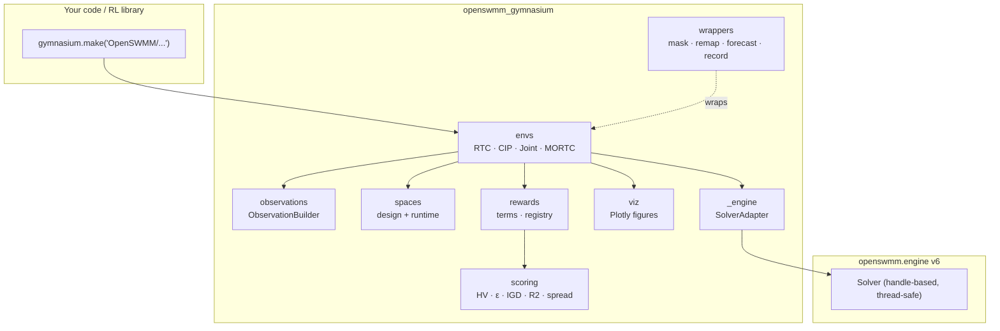
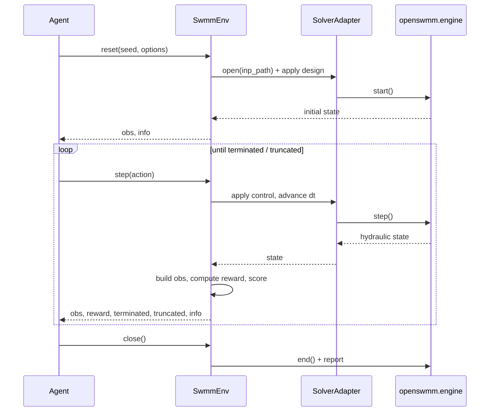

# openswmm.gymnasium

[](https://github.com/HydroCouple/openswmm.gymnasium/blob/main/LICENSE)
[](https://www.python.org/downloads/)
[](https://github.com/HydroCouple/openswmm.gymnasium/actions/workflows/lint.yml)
[](https://github.com/HydroCouple/openswmm.gymnasium/actions/workflows/unit_testing.yml)
[](https://github.com/HydroCouple/openswmm.gymnasium/actions/workflows/documentation.yml)
[](https://gymnasium.farama.org/)
[](https://github.com/astral-sh/ruff)
[](https://github.com/HydroCouple/openswmm.gymnasium)

[Farama Gymnasium](https://gymnasium.farama.org/) environments for joint
**Capital Improvement Plan (CIP)** design and **Real-Time Control (RTC)**
optimization of [SWMM](https://www.epa.gov/water-research/storm-water-management-model-swmm)
stormwater networks, with first-class **multi-objective** scoring.

Built on the handle-based, thread-safe
[openswmm.engine](https://github.com/HydroCouple/openswmm.engine) v6 Python
API, so every environment runs a real hydraulic/hydrologic simulation — not a
surrogate — and many environments can be stepped concurrently in separate
threads.

> **Status:** pre-release, under active development. See
> [docs/IMPLEMENTATION_PLAN.md](https://github.com/HydroCouple/openswmm.gymnasium/blob/main/docs/IMPLEMENTATION_PLAN.md)
> for the authoritative scope, architecture, and milestone schedule.

---

## Why this package?

Operating and upgrading urban drainage systems is a sequential decision problem
under uncertainty: *which* assets to build (CIP) and *how* to operate gates,
pumps, and orifices through a storm (RTC). `openswmm.gymnasium` exposes that
problem as standard Gymnasium environments so you can throw the full
reinforcement-learning and multi-objective-optimization toolchain at it.

- **Real physics.** Each `step()` advances the SWMM dynamic-wave solver.
- **CIP, RTC, or both.** Single-objective and multi-objective variants, plus a
  joint environment that picks a design at `reset()` and controls it at runtime.
- **Multi-objective native.** Built-in hypervolume, ε-indicator, IGD, R2, and
  spread scoring over the achieved Pareto front.
- **Batteries included.** Ten bundled benchmark scenarios (`b01`–`b10`),
  observation builders, reward terms, action wrappers, and Plotly trajectory
  visualizations.

## Architecture



## Installation

**Requirements:** Python 3.10+ and the compiled `openswmm.engine` v6
(installed automatically as a dependency).

### From PyPI

```bash
pip install openswmm.gymnasium                      # core
pip install "openswmm.gymnasium[mo]"                # + multi-objective (mo-gymnasium)
pip install "openswmm.gymnasium[platypus]"          # + Platypus MOO adapter
pip install "openswmm.gymnasium[viz]"               # + Plotly trajectory visualizations
pip install "openswmm.gymnasium[mo,platypus,viz]"   # everything
```

### From source (for development)

```bash
git clone https://github.com/HydroCouple/openswmm.gymnasium.git
cd openswmm.gymnasium
pip install -e ".[dev,docs,mo,platypus,viz]"
```

The `[dev]` extra installs `pytest`, `pytest-cov`, and `ruff`; `[docs]` adds
Sphinx, the PyData theme, MyST, and Mermaid support for building these docs.

### Verify the install

```python
import gymnasium as gym
import openswmm_gymnasium  # registers the OpenSWMM/* env IDs on import

print(openswmm_gymnasium.__version__)
env = gym.make("OpenSWMM/TwinTank-RTC-v0")
print(env.observation_space, env.action_space)
env.close()
```

If this prints the version and the env's spaces without error, you're ready.

## Quickstart

A 30-second end-to-end episode using the bundled `b01 TwinTank` benchmark:

```python
import gymnasium as gym
import openswmm_gymnasium  # triggers env registration

env = gym.make("OpenSWMM/TwinTank-RTC-v0")
obs, info = env.reset(seed=0)

terminated = truncated = False
cumulative_reward = 0.0
while not (terminated or truncated):
    action = env.action_space.sample()          # replace with your policy
    obs, reward, terminated, truncated, info = env.step(action)
    cumulative_reward += reward

print(f"Final reward: {cumulative_reward:.3f}")
print(f"Per-component breakdown: {info['reward_components']}")
env.close()
```

### Multi-objective control with hypervolume scoring

```python
import gymnasium as gym
import openswmm_gymnasium

env = gym.make("OpenSWMM/TwinTank-MORTC-v0")
obs, info = env.reset(seed=0)

terminated = truncated = False
while not (terminated or truncated):
    action = env.action_space.sample()
    obs, reward_vec, terminated, truncated, info = env.step(action)

print(f"Normalised hypervolume: {info['mo_score']:.3f}")   # in [0, 1]
print(f"Cumulative cost vector: {info['cumulative_cost']}")
env.close()
```

### Joint CIP + RTC

Pick a capital design at `reset()`, then control it at runtime:

```python
import gymnasium as gym
import numpy as np
import openswmm_gymnasium

env = gym.make("OpenSWMM/TwinTank-Joint-v0")

design = {"node_max_depth": np.array([10.0, 14.0], dtype=np.float32)}
obs, info = env.reset(seed=0, options={"design_action": design})

terminated = truncated = False
while not (terminated or truncated):
    action = env.action_space.sample()          # runtime control; design is fixed after reset
    obs, reward, terminated, truncated, info = env.step(action)
env.close()
```

### The agent / environment loop



### Recording and visualizing runs

```python
import gymnasium as gym
import openswmm_gymnasium
from openswmm_gymnasium.wrappers import RecordTrajectory
from openswmm_gymnasium.viz import TrajectoryRun
from openswmm_gymnasium.viz.figures import pareto_front

env = RecordTrajectory(gym.make("OpenSWMM/TwinTank-MORTC-v0"), "artifacts/run-001/")
for ep in range(20):
    env.reset(seed=ep)
    terminated = truncated = False
    while not (terminated or truncated):
        _, _, terminated, truncated, _ = env.step(env.action_space.sample())
env.close()

run = TrajectoryRun.from_dir("artifacts/run-001/")
pareto_front(run).write_html("pareto.html")
```

## Environments

Environment IDs follow `OpenSWMM/<Scenario>-<Variant>-v<N>` and register on
`import openswmm_gymnasium`.

| Variant  | Class                  | Description                                        |
| -------- | ---------------------- | -------------------------------------------------- |
| `RTC`    | `SwmmRTCEnv`           | Single-objective real-time control                 |
| `CIP`    | `SwmmCIPEnv`           | Single-objective capital design (pre-simulation)   |
| `Joint`  | `SwmmJointCIPRTCEnv`   | Design at `reset()` + control at runtime           |
| `MORTC`  | `SwmmMORTCEnv`         | Multi-objective RTC with vector rewards + scoring   |

Framework-level `OpenSWMM/Minimal-*-v0` envs back the test suite, while the
`b01`–`b10` benchmark scenarios (e.g. `OpenSWMM/TwinTank-RTC-v0`) provide ready
-to-run problems. List everything currently registered with:

```python
import gymnasium as gym
import openswmm_gymnasium
print([k for k in gym.registry if k.startswith("OpenSWMM/")])
```

## Testing

The test suite runs against the **real** `openswmm.engine`, so a successful run
also confirms your engine install:

```bash
pip install -e ".[dev]"

pytest                                   # full suite
pytest tests/unit/test_envs_joint.py     # a single module
pytest -k scoring                         # by keyword
pytest --cov                              # with coverage (config in pyproject.toml)
```

Lint and import-order checks use ruff:

```bash
ruff check .        # lint
ruff format .       # auto-format
```

CI runs the same lint, unit-testing, and documentation jobs on every push and
pull request.

## Documentation

The full documentation — getting started, user guide, developer guide, and the
auto-generated API reference — is published at
**<https://hydrocouple.github.io/openswmm.gymnasium>** and uses this README as
its landing page.

Build it locally:

```bash
pip install -e ".[docs]"
cd docs
make html        # output in docs/_build/html/index.html
```

## Contributing

Contributions are welcome! Please read
[CONTRIBUTING.md](https://github.com/HydroCouple/openswmm.gymnasium/blob/main/CONTRIBUTING.md)
and note that all contributors must sign the
[Contributor License Agreement](https://github.com/HydroCouple/openswmm.gymnasium/blob/main/CLA.md).
By participating you agree to abide by our
[Code of Conduct](https://github.com/HydroCouple/openswmm.gymnasium/blob/main/CODE_OF_CONDUCT.md).

## License

Apache License, Version 2.0 — see [LICENSE](https://github.com/HydroCouple/openswmm.gymnasium/blob/main/LICENSE) and [NOTICE](https://github.com/HydroCouple/openswmm.gymnasium/blob/main/NOTICE).
